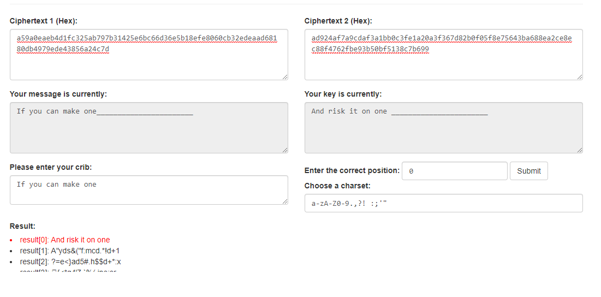

Weak salt problem
========
## Task
This is normal text ciphered with a strong algorithm (Salsa20), but every line is ciphered with the same key and no nonce is being used. Name the author of these lines.

ad924af7a9cdaf3a1bb0c3fe1a20a3f367d82b0f05f8e75643ba688ea2ce8ec88f4762fbe93b50bf5138c7b699  
a59a0eaeb4d1fc325ab797b31425e6bc66d36e5b18efe8060cb32edeaad68180db4979ede43856a24c7d  
a59a0eaeaad7fc3c56fe82fd1f6bb5a769c43a0f0cfae74f0df56fdae3db8d9d840875ecae2557bf563fcea2  
a59a0eaea8ddf93c08fe81e11e2ab2bb6d962f0f1af2f44243b46cc1b6d6c291995d65a9a5234aa204  
ad924af7a9cdaf3a1bb0c3f51439a5b628cf215a1fbdee4302a77a8ea2cc86c8984d65ffac6c58bf5b71dab8841136  
b09b4afda3caf93c5aa78ce6096bb2a67ad86e4302f3e10602b37acbb1829680935137e8bb2919b6503fccfdca5461  
a59a0eaeb5d7af3115b287b31425e6a460d3200f19f5e35406f567dde3cc8d9c9e4179eee92557f1463edc  
a18c09ebb6ccaf2d12bbc3c41227aaf37fde274c05bdf5471aa62edaac82968093452da9eb0456bd5b71c6bfcb56

ad924af7a9cdaf3a1bb0c3e71a27adf37fdf3a474dfef44914b17d8ea2cc86c89d4d72f9e93556a44d71dfb8980034b3cea5c4d4  
ab864af9a7d4e4790db797fb5b00afbd6fc5acaff9f3e95443b961dda6829680930874e6a42156bf1f25c6a4891c6d  
ad924ae0a3d1fb311facc3f5142eb5f366d93c0f01f2f04f0db22ec8b1cb8786925b37eaa82219b94a23ddf1931b34fa  
ad924aefaad4af341fb0c3f0143ea8a728c1275b05bdff4916f92eccb6d6c286994672a9bd2356f15224cab9d1  
ad924af7a9cdaf3a1bb0c3f51227aaf37cde2b0f18f3e04911b267d8aacc85c89b4179fcbd29  
b39d1ee6e6cbe6210ea7c3e01e28a9bd6cc5690f1af2f4520bf561c8e3c68b9b824979eaac6c4ba4517d89f1ca  
bd9b1ffcb598e62a5aaa8bf65b0ea7a17cde6e4e03f9a64315b07cd7b7ca8b86910863e1a8381ea21f38c7f183006df6c2a5  
a59a0e6c462cf83113bd8bb31238e6be67c42bcded09ff4916f262c2e3c087c897085ae8a76019bc4671dabe8455  

## Solution

As the text has been encrypted with the same key, we can apply **crib dragging**

## Crib dragging

You take a guess of a common phrase that may appear in one of the plaintexts and exclusive-or that against the XOR of the two original messages in various locations.

We have an 16-time pad.

Line 2-4, 7, 16 and 1, 5, 8, 10-12 and 14-15 starts with a sequence of same letters

We have to guess the author of these lines, so it is likely to be a poem.

In a poem each sentence starts with a capital letter.

Lets try to guess line 1 against line 2 using an online tool https://lzutao.github.io/cribdrag/

After some guessing process I got the line that makes sense.

Google says that the encrypted text is last 16 lines of poem "If" by RUDYARD KIPLING

If you can make one heap of all your winnings  
    And risk it on one turn of pitch-and-toss,  
And lose, and start again at your beginnings  
    And never breathe a word about your loss;  
If you can force your heart and nerve and sinew  
    To serve your turn long after they are gone,     
And so hold on when there is nothing in you  
    Except the Will which says to them: ‘Hold on!’  

If you can talk with crowds and keep your virtue,     
    Or walk with Kings—nor lose the common touch,  
If neither foes nor loving friends can hurt you,  
    If all men count with you, but none too much;  
If you can fill the unforgiving minute  
    With sixty seconds’ worth of distance run,     
Yours is the Earth and everything that’s in it,     
    And—which is more—you’ll be a Man, my son!  
